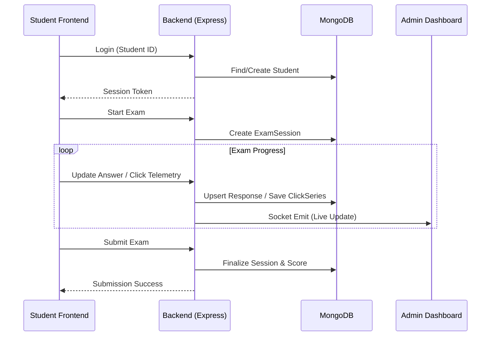

# ⚙️ CognitoMark Backend

The engine behind the High-Fidelity Exam Portal. Handles real-time telemetry, session management, and secure administrative operations.

---

## 📂 Exhaustive File Structure

| Path | Description |
| :--- | :--- |
| `src/server.js` | Entry point. Configures Express, Sockets, and connects to MongoDB. |
| `src/controllers/adminController.js` | Administrative logic: Exam management, reporting, and exports. |
| `src/controllers/sessionController.js` | Core exam logic: Telemetry logging, answer auto-saving, and integrity checks. |
| `src/controllers/studentController.js` | Student identity management and login logic. |
| `src/models/` | Mongoose schemas for `admins`, `students`, `exams`, `questions`, `sessions`, `telemetry`, etc. |
| `src/routes/` | API route definitions for Admin, Student, and Session endpoints. |
| `src/sockets/` | Real-time event orchestration via Socket.IO. |
| `src/middlewares/auth.js` | JWT authentication guard for protected routes. |
| `src/utils/` | Shared helper functions and sequential ID generators. |

---

## 📊 Way of Working: Session lifecycle

---

## 🗄️ Database Reference

This project uses a relational-style architecture within MongoDB using sequential IDs for frontend compatibility.

### Core Collections

- **exams**: Parent entities for questions and sessions.
- **questions**: The question bank with correct answers for auto-scoring.
- **exam_sessions**: Tracks a single student's attempt. Includes aggregate stats like stress and click counts.
- **responses**: Granular storage of actual answers per question.
- **telemetry_events**: Time-ordered stream of behavioral actions (focus lost, click detected, etc.).
- **click_timeseries**: High-precision windowed metrics (10s intervals) for behavioral heatmaps.

---

## 🛠️ Development

### Setup
1. `cd backend`
2. `npm install`
3. Configure `.env`:
   - `MONGODB_URI`
   - `JWT_SECRET`
   - `CLIENT_ORIGIN`
4. `npm run dev`